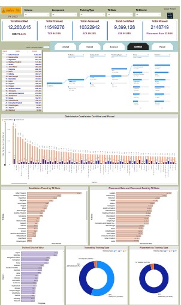

# PMKVY-Power-BI-Plus-Python-Data-Analysis-With-MEL-Focus
# PMKVY Performance Intelligence  
**Power BI Dashboard + Python Analytics (Policy, MEL & Data Science Focus)**

---

## 📌 Overview

This repository presents an **end-to-end performance intelligence framework** for the **Pradhan Mantri Kaushal Vikas Yojana (PMKVY)**.  
It combines **executive-level Power BI dashboards** with **deep analytical and statistical evaluation in Python** to move beyond reporting and into evidence-based program diagnosis.

The project is designed to answer a simple but critical question:

> *Where does the PMKVY training-to-employment pipeline actually break, and why?*

---

## 🎯 What This Project Demonstrates

This is not a visualization-only project. It demonstrates **how an advanced analyst thinks**:

- Translating raw administrative data into **policy-relevant KPIs**
- Separating **output metrics** (enrolment, certification) from **outcome metrics** (placement)
- Diagnosing **structural inefficiencies**, not surface-level trends
- Using **statistical testing** to validate dashboard insights
- Distinguishing **program control** from **market dependency**

---
## 🔗 Live Dashboard & Analytical Notebook

This project is designed to be explored interactively.  
The dashboard provides an executive-level view, while the notebook explains the analytical logic and statistical validation behind the visuals.

### 📊 Power BI – Live Interactive Dashboard
**Executive performance view with cascading slicers and KPI cards**

🔗 https://app.powerbi.com/view?r=eyJrIjoiNmFmYzQ2MWItNzQxZS00MDYyLTk3ODktY2Y2Yjg3ZjU3NTBlIiwidCI6ImYxNjYxNTY4LTMwMjgtNDMyNC05M2E3LWFlNjI4YWE3YjcwOSJ9

## 📊 Power BI Dashboard – Executive View

Below is a snapshot of the **PMKVY Performance Dashboard**, designed for one-glance monitoring and decision support.

---

### 📘 Python Analysis – Google Colab Notebook
**Statistical validation, funnel analysis, and policy-oriented insights**

🔗 https://colab.research.google.com/drive/1LFuVmcaF2KczBqi1nQaCZbj8eSvFxXjX?usp=sharing

---

### How to Use This Project

1. Start with the **Power BI dashboard** for a one-glance understanding of PMKVY performance.
2. Explore the **Colab notebook** to see how KPIs, funnels, volatility metrics, and hypothesis tests were derived.
3. Use both together to understand not just *what* the outcomes are, but *why* they occur.

## 🏗️ Project Architecture

### 1️⃣ Power BI Dashboard (Executive Layer)

The Power BI dashboard is designed for **senior decision-makers, program managers, and monitoring teams** who need clarity in seconds.

**Key features:**
- KPI cards: Enrolled, Trained, Assessed, Certified, Placed
- Cascading slicers: Scheme → Component → Training Type → State → District
- Training pipeline funnel (Enrolment → Placement)
- State and district-level comparisons
- Training-type and component-wise performance views
- Certification vs placement contrasts

**Purpose:**  
Provide a **one-glance understanding** of PMKVY performance across geography, scheme components, and training types.

---

### 2️⃣ Python Analytics (Analytical & Validation Layer)

The Python notebooks complement the dashboard by answering **questions dashboards alone cannot**.

**Core analyses include:**
- Funnel analysis using **counts and conversion rates**
- State-wise and region-wise efficiency diagnostics
- Training-type employability volatility analysis
- Best vs worst state comparisons using robust efficiency metrics
- Hypothesis testing to validate observed patterns

This layer ensures insights are **statistically defensible**, not anecdotal.

---

## 🔍 Key Analytical Insights

### 1. Certification ≠ Placement
Statistical testing shows **no significant association** between certification success and placement outcomes at the state level.

**Implication:**  
Improving training quality alone will not guarantee employment gains.

---

### 2. Funnel Drop-offs Are Structural
Friedman test results confirm that conversion rates across stages (TCR, ACR, CSR) differ **significantly**, proving that drop-offs are **systematic**, not random.

---

### 3. Placement Is Structurally Volatile
Using coefficient of variation:
- Certification outcomes are **highly stable**
- Placement outcomes are **extremely volatile**

This volatility reflects:
- Regional labor market conditions  
- Industry absorption capacity  
- Employer linkage strength  

---

### 4. Region & Training Type Matter
- Some regions show **high placement volatility** despite reasonable averages
- Several training types exhibit **high certification but weak employability**, indicating demand mismatch

**Conclusion:**  
Uniform national targets mask structural disparities.

---

## 📐 Statistical Methods Used

- Spearman rank correlation
- Friedman test (repeated measures)
- Mann–Whitney U test
- Variance and coefficient of variation analysis
- Funnel-based efficiency diagnostics

All methods were chosen based on **data structure and analytical validity**.

---

## 🧠 Why This Project Is Different

Most PMKVY analyses stop at:
- Counts
- Simple ratios
- Static dashboards

This project goes further by:
- Testing whether differences are **statistically meaningful**
- Separating **performance from stability**
- Translating analytics into **monitoring and policy recommendations**

This is the difference between **reporting** and **evaluation**.

---

## 👥 Who This Is For

- Monitoring, Evaluation & Learning (MEL) professionals  
- Policy and government consulting teams  
- Skill development program managers  
- Data analysts working with large administrative datasets  

---

## 🛠️ Tools & Technologies

- **Python** (Pandas, NumPy, SciPy, Plotly)
- **Power BI**
- **Statistical inference**
- **Dashboard storytelling**

---

---

## 🧩 Final Takeaway

> **Certification reflects program control.  
> Placement reflects market reality.  
> Volatility reveals where control ends.**

This project demonstrates how data can move beyond reporting to **diagnosis, validation, and decision support**.

---

---

